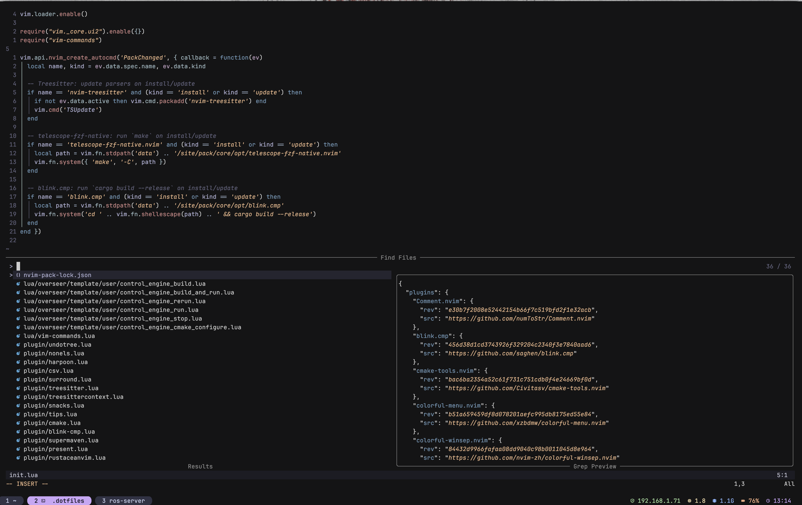

# .dotfiles

zsh, neovim, kitty and television configs, plus the package list and the
script that turns a bare machine into a working one.



## New machine

```bash
git clone https://github.com/abishz17/.dotfiles.git ~/.dotfiles
cd ~/.dotfiles && ./bootstrap.sh
```

Then open a new shell. `bootstrap.sh` is idempotent - re-run it after a `git pull`
to pick up new `Brewfile` entries.

## What bootstrap.sh does

| Step | Why it exists |
|---|---|
| Homebrew | Everything else is installed through it |
| `brew bundle` | Restores the packages in `Brewfile` - without them every symlink below points at a program that is not installed |
| oh-my-zsh | `.zshrc` sources `$ZSH/oh-my-zsh.sh`. Missing it means the shell config stops loading half way down |
| zsh-autosuggestions, zsh-syntax-highlighting | Named in `plugins=(...)` but not shipped with oh-my-zsh |
| `stow .` | Symlinks the configs into `$HOME` |

## Updating the package list

After installing something you want to keep:

```bash
brew bundle dump --file=Brewfile --force
```

Commit the diff. That file is the difference between a repo full of configs and
a machine that actually works.

## Not automated

Installed by their own scripts, listed here so a rebuild does not quietly miss them:

- `bun`, `opam`
- AI CLIs on `PATH` in `.zshrc` that are not brew/npm packages: amp, grok,
  kimi-code, antigravity-ide
- macOS system settings (`defaults write`), app licences, SSH and GPG keys

Everything else is in the `Brewfile`, including the `go`, `npm`, `cargo` and `uv`
tool entries that `brew bundle dump` captures alongside the formulae.

Neovim needs nothing - `.config/nvim/nvim-pack-lock.json` pins every plugin to a
commit and restores them on first launch.

## Layout notes

- `.stow-local-ignore` keeps repo files (`Brewfile`, `bootstrap.sh`, `README.md`)
  out of `$HOME`. Its patterns are Perl regexes **anchored at both ends**, and its
  presence replaces stow's built-in defaults, so `.git` is listed explicitly.
- `.zshrc` resolves `$BREW_PREFIX` at the top rather than hardcoding
  `/opt/homebrew`, so it works on Apple Silicon, Intel, and Linuxbrew.
- No absolute `/Users/<name>` paths anywhere. `$HOME` only.

## Stow conflicts

A fresh macOS ships its own `~/.zshrc`, so the first `stow` can fail with a
conflict. Either move the file aside and re-run, or adopt it and look at what
the machine had:

```bash
stow --adopt --target="$HOME" .
git diff          # what the machine had that this repo did not
git checkout .    # keep the repo's version, discard the machine's
```
